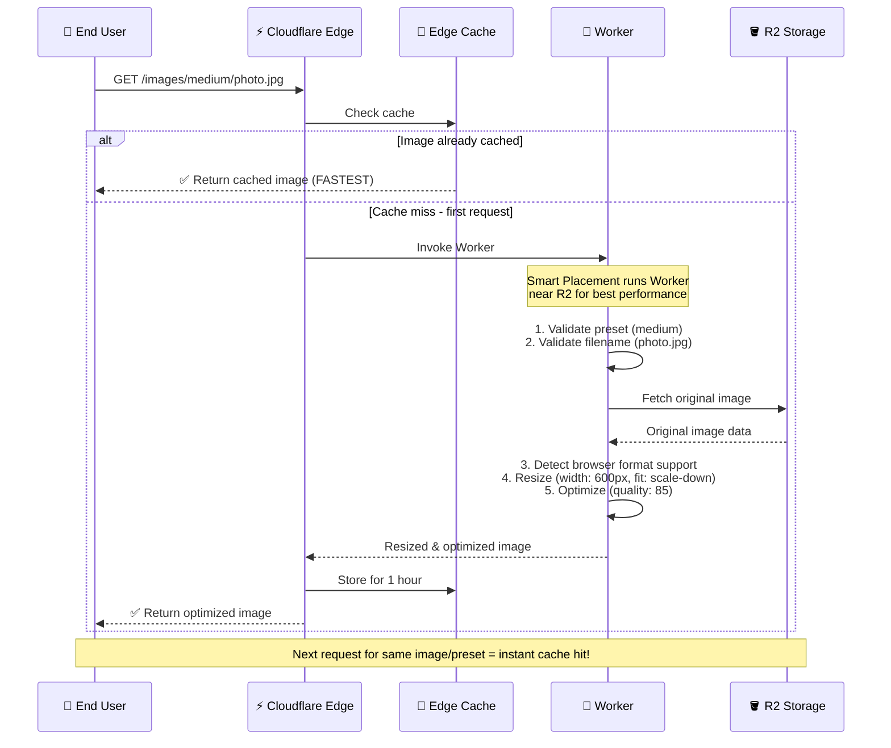
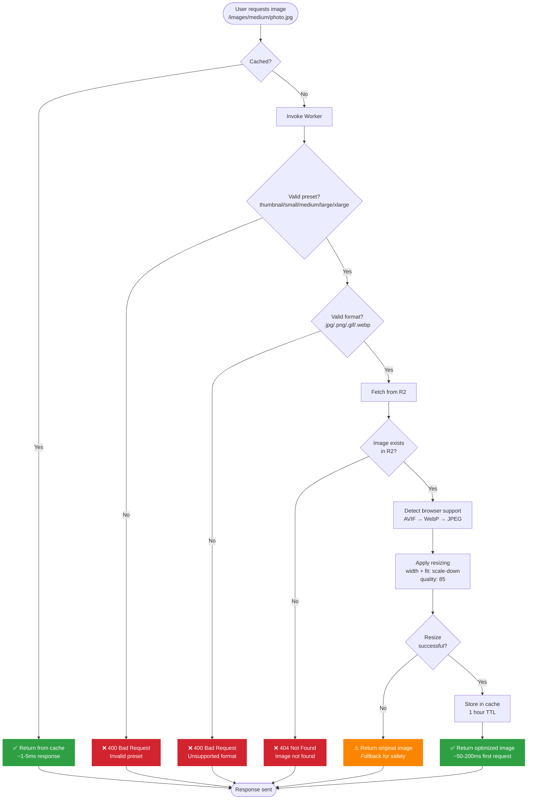

# Image Resizing with R2

[](https://deploy.workers.cloudflare.com/?url=https://github.com/cloudflare/templates/tree/main/image-resizing-r2-template)


<!-- dash-content-start -->

A production-ready Cloudflare Worker that serves images from [R2](https://developers.cloudflare.com/r2/) storage with on-the-fly [image resizing](https://developers.cloudflare.com/images/transform-images/) using custom URL presets. This template demonstrates how to build a custom image CDN with:

- **Custom URL scheme**: Use friendly preset names (`thumbnail`, `medium`, `large`) instead of pixel dimensions
- **Only original images stored**: No need to store multiple variants in R2
- **Automatic format optimization**: Serves AVIF, WebP, or JPEG based on browser support
- **Edge caching**: Transformed images cached automatically for fast delivery
- **Smart Placement**: Worker runs optimally near your R2 bucket

> [!IMPORTANT]
> When using C3 to create this project, you'll need to create an R2 bucket and update your `wrangler.jsonc` configuration before deploying. Follow the [setup steps](#setup-instructions) below.

<!-- dash-content-end -->

## Getting Started

Outside of this repo, you can start a new project with this template using [C3](https://developers.cloudflare.com/pages/get-started/c3/) (the `create-cloudflare` CLI):

```bash
npm create cloudflare@latest -- --template=cloudflare/templates/image-resizing-r2-template
```

A live public deployment of this template is available at [https://image-resizing-r2-template.templates.workers.dev](https://image-resizing-r2-template.templates.workers.dev)

## Architecture Overview

This template implements **Pattern 2: Custom Worker for Controlled Image Access** from Cloudflare's reference architectures.

### Request Flow Diagram

The following diagrams show how requests flow through Cloudflare's infrastructure:

#### Main Request Flow (Happy Path)



#### Decision Flow & Error Handling



### How It Works

1. **User requests an image** with a preset size: `https://example.com/images/medium/photo.jpg`
2. **Cloudflare Edge checks cache** - if the resized image exists, return immediately (fastest path)
3. **Worker is invoked** on cache miss and validates the preset and filename
4. **Fetches original image from R2** bucket (only original, full-quality images stored)
5. **Applies on-the-fly resizing** based on the preset dimensions
6. **Performs format negotiation** (AVIF → WebP → JPEG) based on client `Accept` header
7. **Returns optimized image** with automatic caching (minimum 1 hour at the edge)
8. **Subsequent requests** served instantly from edge cache

### Key Benefits

- ✅ **Only original images stored in R2** - no need to store multiple variants
- ✅ **Custom URL scheme** - use friendly preset names instead of pixel dimensions
- ✅ **Automatic format optimization** - serves AVIF, WebP, or JPEG based on browser support
- ✅ **Built-in caching** - transformed images cached automatically at the edge
- ✅ **Zero infrastructure management** - fully serverless solution
- ✅ **Global performance** - leverages Cloudflare's global network

## Prerequisites

Before you begin, ensure you have:

1. A [Cloudflare account](https://dash.cloudflare.com/sign-up)
2. [Node.js](https://nodejs.org/) version 18 or higher
3. [Wrangler CLI](https://developers.cloudflare.com/workers/wrangler/install-and-update/) installed globally:
   ```bash
   npm install -g wrangler
   ```

## Setup Instructions

### 1. Create an R2 Bucket

First, authenticate with Cloudflare:

```bash
wrangler login
```

Create a new R2 bucket to store your images:

```bash
wrangler r2 bucket create my-images
```

Replace `my-images` with your preferred bucket name.

### 2. Configure Wrangler

Update the `wrangler.jsonc` file with your bucket name:

```jsonc
{
  "name": "image-resizing-r2-template",
  "r2_buckets": [
    {
      "binding": "MY_BUCKET",
      "bucket_name": "my-images"  // ← Replace with your bucket name
    }
  ]
}
```

### 3. Install Dependencies

```bash
npm install
```

### 4. Upload Images to R2

Upload your original images to the R2 bucket. You can use the Wrangler CLI:

```bash
# Upload a single file
wrangler r2 object put my-images/photo.jpg --file ./path/to/photo.jpg

# Upload with custom metadata
wrangler r2 object put my-images/photo.jpg --file ./path/to/photo.jpg \
  --content-type "image/jpeg" \
  --cache-control "public, max-age=31536000"
```

Alternatively, use the [R2 API](https://developers.cloudflare.com/r2/api/s3/api/) or dashboard to upload images.

**Best Practice:** Store images with descriptive filenames and organize them in folders if needed:
- `products/item-123.jpg`
- `avatars/user-456.png`
- `blog/2024/header-image.webp`

## Local Development

Start the local development server:

```bash
npm run dev
```

The Worker will be available at `http://localhost:8787`.

Test with a sample image:
```bash
# Assuming you have photo.jpg in your R2 bucket
curl http://localhost:8787/images/medium/photo.jpg
```

## Deployment

Deploy your Worker to Cloudflare:

```bash
npm run deploy
```

After deployment, your Worker will be available at:
```
https://image-resizing-r2-template.<your-subdomain>.workers.dev
```

To use a custom domain, configure a route in the Cloudflare dashboard or add to `wrangler.jsonc`:

```jsonc
{
  "routes": [
    {
      "pattern": "images.example.com/*",
      "zone_name": "example.com"
    }
  ]
}
```

## URL Format and Usage

### URL Structure

```
https://your-domain.com/images/[preset]/[filename]
```

- `[preset]` - One of the predefined size presets
- `[filename]` - The filename of the image in your R2 bucket (including any folder paths)

### Available Presets

| Preset | Width | Typical Use Case |
|--------|-------|------------------|
| `thumbnail` | 150px | User avatars, small thumbnails |
| `small` | 300px | Image galleries, list views |
| `medium` | 600px | Article images, product photos |
| `large` | 900px | Featured images, hero sections |
| `xlarge` | 1920px | Full-width banners, high-res displays |

### Example URLs

```bash
# Thumbnail version
https://example.com/images/thumbnail/products/item-123.jpg

# Medium version for article
https://example.com/images/medium/blog/2024/header.jpg

# Large version for hero image
https://example.com/images/large/hero-banner.png

# Extra-large for retina displays
https://example.com/images/xlarge/photography/landscape.jpg
```

### Supported Image Formats

Input formats:
- JPEG (`.jpg`, `.jpeg`)
- PNG (`.png`)
- GIF (`.gif`)
- WebP (`.webp`)

Output formats (automatic based on browser support):
- AVIF (best compression, modern browsers)
- WebP (good compression, wide support)
- JPEG (fallback for older browsers)

## Caching Behavior

This template implements Cloudflare's recommended caching strategy:

- **Original images**: Cached based on R2 object's `Cache-Control` header
- **Resized images**: Cached for minimum 1 hour at the edge
- **Changes to resize options**: Take effect immediately, no purging needed
- **Cache key**: Based on the original image URL, not the Worker URL

To update an image:
1. Upload the new version to R2 with the same filename
2. The cache will respect the `Cache-Control` headers
3. For immediate updates, add `must-revalidate` to the `Cache-Control` header

## Best Practices for Production

### 1. Image Organization

Organize images in R2 using a logical structure:
```
/products/
  /category-a/
    item-1.jpg
    item-2.jpg
  /category-b/
    item-3.jpg
/blog/
  /2024/
    /01/
      post-image.jpg
```

### 2. Optimize Original Images

- Upload high-quality originals (preferably the largest size you'll need)
- Use the `xlarge` preset size (1920px) as a guideline for maximum width
- The Worker will automatically prevent upscaling with `fit: scale-down`

### 3. Set Proper Cache Headers

When uploading to R2, set appropriate cache headers:
```bash
wrangler r2 object put my-images/photo.jpg \
  --file ./photo.jpg \
  --cache-control "public, max-age=31536000, immutable"
```

### 4. Monitor Performance

Use Wrangler to monitor your Worker:
```bash
npm run tail
```

Enable observability in `wrangler.jsonc` for analytics and logs.

### 5. Error Handling

The Worker includes comprehensive error handling:
- Invalid presets → 400 Bad Request with helpful message
- Unsupported formats → 400 Bad Request
- Missing images → 404 Not Found
- Resize failures → Graceful fallback to original image

### 6. Security Considerations

- The Worker validates all input parameters
- Only specified file extensions are allowed
- Request loop prevention is built-in
- No authentication is required (images are public)

For private images, consider adding:
- API key validation
- Signed URLs
- Rate limiting

## Troubleshooting

### Image not found (404)

- Verify the image exists in your R2 bucket:
  ```bash
  wrangler r2 object get my-images/photo.jpg
  ```
- Check the filename matches exactly (case-sensitive)
- Ensure the file was uploaded successfully

### Invalid preset error (400)

- Use only the defined presets: `thumbnail`, `small`, `medium`, `large`, `xlarge`
- Check URL format: `/images/[preset]/[filename]`

### Resize timeout or failure

- Original image might be too large (>100MB or >100 megapixels)
- Worker will fall back to original image automatically
- Consider pre-optimizing very large images before uploading

### Request loop detected

The Worker includes loop prevention. If you see this issue:
- Ensure your Worker route doesn't overlap with other Workers
- Check that the `via` header detection is working

## Customization

### Add Custom Presets

Edit `src/index.ts` and add to the `SIZE_PRESETS` object:

```typescript
const SIZE_PRESETS: Record<string, number> = {
  thumbnail: 150,
  small: 300,
  medium: 600,
  large: 900,
  xlarge: 1920,
  // Add your custom presets
  card: 400,
  banner: 1200,
};
```

### Change Image Quality

Adjust the quality setting in `src/index.ts`:

```typescript
const resizingOptions: RequestInitCfPropertiesImage = {
  width: SIZE_PRESETS[preset],
  fit: 'scale-down',
  quality: 90, // Increase for higher quality (1-100)
};
```

### Add Authentication

To protect your images, add authentication logic:

```typescript
// Check for API key
const apiKey = request.headers.get('X-API-Key');
if (apiKey !== env.API_KEY) {
  return new Response('Unauthorized', { status: 401 });
}
```

Don't forget to add the `API_KEY` binding to `wrangler.jsonc`.

## Additional Resources

- [Cloudflare Image Resizing Documentation](https://developers.cloudflare.com/images/transform-images/)
- [R2 Documentation](https://developers.cloudflare.com/r2/)
- [Workers Documentation](https://developers.cloudflare.com/workers/)
- [Image Resizing Best Practices](https://developers.cloudflare.com/images/transform-images/transform-via-workers/)
- [R2 API Reference](https://developers.cloudflare.com/r2/api/workers/workers-api-reference/)

## License

MIT

## Contributing

Contributions are welcome! Please feel free to submit issues or pull requests.

